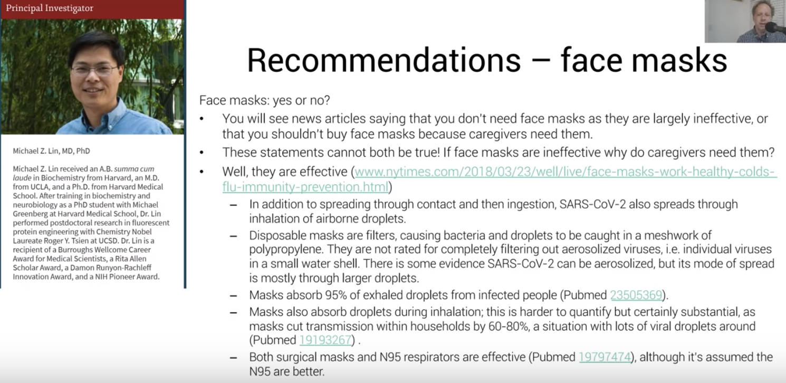

---

firstPublishedAt: 2020-02-01
title: Joining \#Masks4All against Coronavirus
tag: Personal
author_profile: true 
toc: true
mathjax: true
header:
  teaser: /assets/images/covid19/effect-against-particles.png
  og_image: /assets/images/covid19/effect-against-particles.png
---

I am a avid viewer of Lex Fridman's podcasts and other misc. content, particularly his Youtube videos. I recently watched one of his videos on ["Face Masks for All" & DIY Masks, seen here](https://www.youtube.com/watch?v=qFmaSNP6_z4).

In it, he discusses what you need to know about face masks and its impact on it and the spread of COVID19 (2019 Coronavirus)
> The DIY mask portion is on minute [5:18 of the video](https://youtu.be/qFmaSNP6_z4?t=318).

From this video, I too wanted to take action to inform individuals the impact on face masks and how to protect yourself from both the viral pandemic and misinformation pandemic. 

<blockquote class="twitter-tweet">
Misinformation being spread by the <a href="https://twitter.com/WHO?ref_src=twsrc%5Etfw">@WHO</a> about masks 😷  “There is no evidence they protect people who are not sick.”  Yet seconds later, they advise wearing a mask if you’re near someone with coronavirus. So they clearly do protect people who aren’t sick.<a href="https://t.co/qE3qmaBdtt">https://t.co/qE3qmaBdtt</a>
&mdash; Sam Feldman (@sam_feldman_) <a href="https://twitter.com/sam_feldman_/status/1242158248792330244?ref_src=twsrc%5Etfw">March 23, 2020</a></blockquote> 

Moreover, I wanted to provide another alternative to save masks for healthcare workers that would need disposable (N95 or surgical) masks, when they come in supply again.

## How to control the spread of the COVID19 (Coronavirus) Pandemic

Overall, from what Lex echoed from the reseach is that we need to:

1. Test
2. Trace 
3. Quarantine infected
4. #Masks4All

### How does the virus spread?

At a high level, there are 3 ways this virus can spread:
1. Contact
2. Droplet
3. Airborne

Bulletins 1 & 2 are focused cases to be aware of, but bulletin 3  too can be of a matter, unless you are within some distance amount of covid19-positive individuals (now you get why the 6ft mandate matters)

Now that individuals are social distancing, how else can we stop the spread of COVID19 through "Droplets" not being able to reach onto your face, mouth, etc?

Masks.

### How do we know \#Masks4All work?

In one of Jeremy Howard's summary of research articles, we observe the coronavirus cases cumulative # of cases over time:

Notice the significant difference between the cumulative curves with "shapes" of growth in cases of the virus climbing to higher numbers and the "shaps" of growth in cases not climbing so much. 

What are some of the factors that make this difference?

There can be cultural differences of hygenie, logistic deployment of resources, government action (i.e. reaction), or...cultural differences in how to react being sick?

In Japan, Hong Kong, and Singapore, we notice that maybe...maybe masks work? Who's to know? Well, luckily there is academic research proving the degree of effect on masks to protect society, and yourself.

> In the articles and videos, we hear about the Czech Republic or Tawain are examples of having low growth in counts of the COVID19. More can be found there an other resources, at the end of this article.

[Source](https://youtu.be/BoDwXwZXsDI?t=1908)

But I leave you with a question--**What will you do?**

## My DIY Mask Attempt

<blockquote class="twitter-tweet">
My attempt at <a href="https://twitter.com/hashtag/Masks4All?src=hash&amp;ref_src=twsrc%5Etfw">#Masks4All</a> <a href="https://t.co/rl9mb6X3Pd">pic.twitter.com/rl9mb6X3Pd</a>
&mdash; Raul ∈ 🌤️📊 Ø (@RaulingAverage) <a href="https://twitter.com/RaulingAverage/status/1244144002657476608?ref_src=twsrc%5Etfw">March 29, 2020</a></blockquote> 

### Using the leftovers

<blockquote class="twitter-tweet">
Using the leftover material to make 2 more DIY masks. <a href="https://t.co/IygW3UUEdq">pic.twitter.com/IygW3UUEdq</a>
&mdash; Raul ∈ 🌤️📊 Ø (@RaulingAverage) <a href="https://twitter.com/RaulingAverage/status/1244145283576913926?ref_src=twsrc%5Etfw">March 29, 2020</a></blockquote> 

### How to wear it?
<blockquote class="twitter-tweet">
Finished product <a href="https://t.co/HYQpnK7QxR">pic.twitter.com/HYQpnK7QxR</a>
&mdash; Raul ∈ 🌤️📊 Ø (@RaulingAverage) <a href="https://twitter.com/RaulingAverage/status/1244144604762353664?ref_src=twsrc%5Etfw">March 29, 2020</a></blockquote> 

### How not to wear it?

<blockquote class="twitter-tweet">
How not to wear it <a href="https://t.co/i3VI6kABhK">pic.twitter.com/i3VI6kABhK</a>
&mdash; Raul ∈ 🌤️📊 Ø (@RaulingAverage) <a href="https://twitter.com/RaulingAverage/status/1244144694457593866?ref_src=twsrc%5Etfw">March 29, 2020</a></blockquote> 

### Other DIY mask tutorials

* https://www.youtube.com/watch?v=BCJcE-r7kcg
* https://www.youtube.com/watch?v=S9RWII2-5_4
* https://www.youtube.com/watch?v=vTJevg9i7XA

### Notes

* Watch out for 100% cotton shirts, as they have a effectiveness of 50%, compared to cotton blend (effect 70%), seen below and in this video

* When cleaning the mask, either put it in extreme heat for or clean it

* Do not re-use the mask, as the particles can stay on there

* Some other things to consider:

[Source](https://youtu.be/BoDwXwZXsDI?t=1929)

Also, **Stay Home**, please. <3

<iframe src="https://www.facebook.com/plugins/video.php?href=https%3A%2F%2Fwww.facebook.com%2FLOWSTEPPA%2Fvideos%2F246170693444915%2F&show_text=0&width=345" width="345" height="476" style="border:none;overflow:hidden" scrolling="no" frameborder="0" allowTransparency="true" allowFullScreen="true"></iframe>

# Research & Resources

The following is an appendix of existing resources I used for this article, plus the ones provided by researchers Lex Fridmen, Jeremy Howard & Rachel Thomas, and Petr Ludwig

## Petr Ludwig Original Research

* [Original Video](https://www.youtube.com/watch?v=2_8hojsF-nY)

* [Masks for all movement video](https://www.youtube.com/watch?v=HhNo_IOPOtU)

## Czech #masks4all 

* Google Doc: [http://tiny.cc/masks4all](http://tiny.cc/masks4all)

## Jeremy Howard & Rachel Thomas' research paper collection

* [Summary of Research: Video](https://www.youtube.com/watch?v=BoDwXwZXsDI)
* [Summary of Research: Papers](http://tiny.cc/maskswork)

## Lex's resources

* Slides for this video: https://bit.ly/3duqq82
* Slide References: https://bit.ly/covid-19-masks
