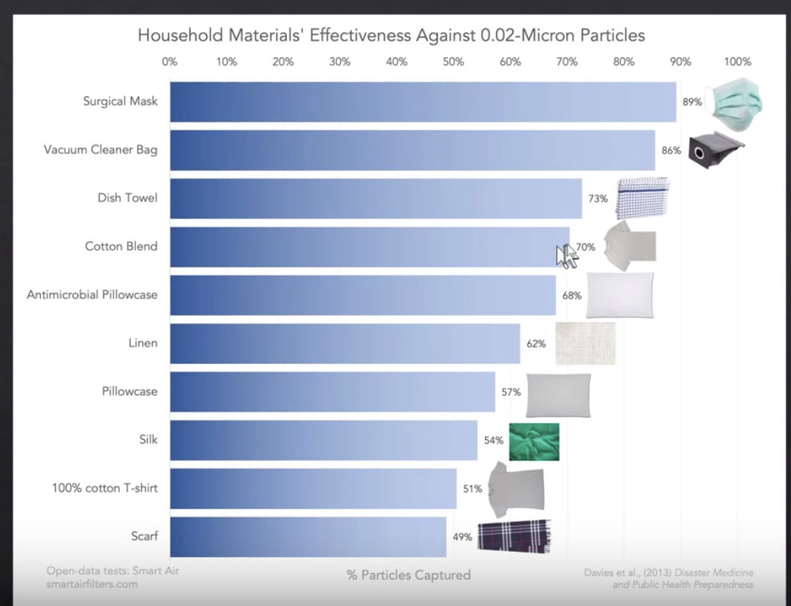
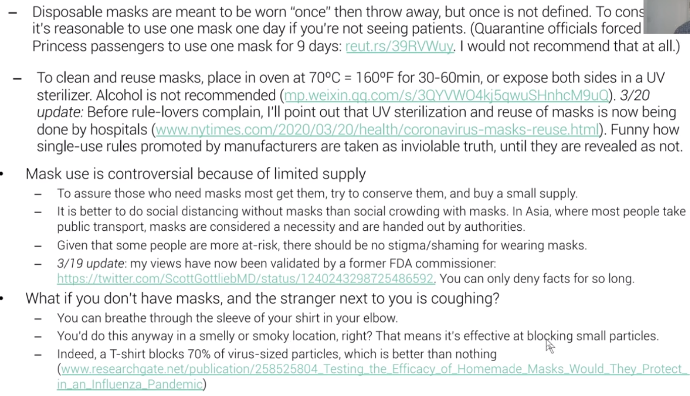

---

firstPublishedAt: 2020-02-01
title: Joining \#Masks4All against Coronavirus
tag: Personal
author_profile: true 
toc: true
mathjax: true
---

I am a avid viewer of Lex Fridman's podcasts and other misc. content, particularly his Youtube videos. I recently watched one of his videos on ["Face Masks for All" & DIY Masks, seen here](https://www.youtube.com/watch?v=qFmaSNP6_z4).

In it, he discusses what you need to know about face masks and its impact on it and the spread of COVID19 (2019 Coronavirus)
> The DIY mask portion is on minute [5:18 of the video](https://youtu.be/qFmaSNP6_z4?t=318).

From this video, I too wanted to take action to inform individuals the impact on face masks and how to protect yourself from both the viral pandemic and misinformation pandemic. Moreover, I wanted to provide another alternative to save masks for healthcare workers that would need disposable (N95 or surgical) masks, when they come in supply again.

## How to control the spread of the COVID19 (Coronavirus) Pandemic

Overall, from what Lex echoed from the reseach is that we need to:

1. Test
2. Trace 
3. Quarantine infected
4. #Masks4All

### How does the virus spread?

There are 3 ways:
1. Contact
2. Droplet
3. Airborne

Bulletins 1 & 2 were the worse cases, but bulletin 3 is not that important, unless you are within some distance amount of covid19-positive individuals (now you get why the 6ft mandate matters)

### How do we know \#Masks4All work?

In one of Jeremy Howard's summary of research articles, we observe the coronavirus cases cumulative # of cases over time:

Notice the significant difference between curves with exponential growth in cases of the virus and the curves with a slower rate of growth in cases of the virus? What are some of the factors that make this difference?

There can be cultural differences of hygenie, logistic deployment of resources, government action (i.e. reaction), or...cultural differences in how to react being sick?

In Japan, Hong Kong, and Singapore, we notice that maybe...maybe masks work? Who's to know? Well, luckily there is academic research proving the degree of effect on masks to protect society, and yourself.

What will you do?

## My DIY Mask Attempt

### How to wear it?

### How not to wear it?

### Other DIY mask tutorials

* https://www.youtube.com/watch?v=BCJcE-r7kcg
* https://www.youtube.com/watch?v=S9RWII2-5_4
* https://www.youtube.com/watch?v=vTJevg9i7XA

### Notes

* Watch out for 100% cotton shirts, as they have a effectiveness of 50%, compared to cotton blend (effect 70%), seen below and in this video

* When cleaning the mask, either put it in extreme heat for or clean it

* Do not re-use the mask, as the particles can stay on there

* Some other things to consider:

[Source](https://youtu.be/BoDwXwZXsDI?t=1929)

# Research & Resources

## Petr Ludwig Original Research

* [Original Video](https://www.youtube.com/watch?v=2_8hojsF-nY)

* [Masks for all movement video](https://www.youtube.com/watch?v=HhNo_IOPOtU)

## Czech #masks4all 

* Google Doc: [http://tiny.cc/masks4all](http://tiny.cc/masks4all)

# Jeremy Howard & Rachel Thomas' research paper collection

* [Summary of Research: Video](https://www.youtube.com/watch?v=BoDwXwZXsDI)
* [Summary of Research: Papers](http://tiny.cc/maskswork)

Slides for this video: https://bit.ly/3duqq82
Slide References: https://bit.ly/covid-19-masks
