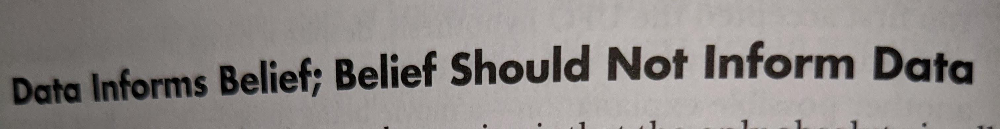

In this article, I list out my resources for reliable COVID-19 updates & research. Moreover, I discuss what holds for Americans after COVID-19.
> Side note: Also, this is a follow up to my March 2020 article ["Joining #Masks4All against Coronavirus"](https://raulingaverage.dev/Joining-Masks4All/)

## Resources

### General

* **Anthony Stephen Fauci** "is an American physician and immunologist who has served as the director of the National Institute of Allergy and Infectious Diseases since 1989"
/cdn.vox-cdn.com/uploads/chorus_asset/file/19867593/acastro_200402_3959_drFauci_0001.jpg)

* [NPR's UpFirst Podcast](https://www.npr.org/podcasts/510318/up-first)
* [The Daily from New York Times](https://www.nytimes.com/column/the-daily)

### Twitter 

Twitter has been always great with not only random spew of memes, jokes, and real time conversations, but also following noteable people. Here are some noteable people that I rely on for COVID-19 Opinions & Research Updates:

* Epidemiology Asst. prof [@EpiEllie](https://twitter.com/EpiEllie)
* Ex-Obama health care head. [@ASlavitt](https://twitter.com/ASlavitt)
* Assistant Professor of Biostatistics [@nataliexdean](https://twitter.com/nataliexdean)
* infectious disease epidemiology [@emma__glennon](https://twitter.com/emma__glennon)
* Biostatistician [@LucyStats](https://twitter.com/LucyStats)
* Biology Professor @UW [@CT_Bergstrom](https://twitter.com/CT_Bergstrom)
* Associate Professor in the Center for Policy and Research in Emergency Medicine, Oregon [@choo_ek](https://twitter.com/choo_ek)
* Epidemiologist & Health Economist. [DrEricDing](https://twitter.com/DrEricDing)
    * Note: Some of his more recent tweets have become a mix bag of items, than sole-COVID19 topics

<blockquote class="twitter-tweet">
SMALL GATHERINGS—I’m most worried about private small gatherings now. They are not publicly visible &amp; difficult to monitor gathering sizes &amp; masks. And people often let their guards down w/ friends/guests in own home. It’s a serious blindspot. <a href="https://twitter.com/hashtag/COVID19?src=hash&amp;ref_src=twsrc%5Etfw">#COVID19</a> <a href="https://t.co/tu2eIN0sfG">pic.twitter.com/tu2eIN0sfG</a>
&mdash; Eric Feigl-Ding (@DrEricDing) <a href="https://twitter.com/DrEricDing/status/1335249398088036354?ref_src=twsrc%5Etfw">December 5, 2020</a></blockquote> 

## Looking into the future

### Liability, and Insurance Eligibility for COVID-19 

#### ["Lawmakers pressure leaders to reach COVID-19 relief deal"](https://thehill.com/homenews/senate/528697-lawmakers-pressure-leaders-to-reach-covid-19-relief-deal)

Currently, American GOP (Republicans) have been pressuring to "push for coronavirus-related liability protections for businesses, schools, nonprofit groups and religious organizations."

**How does this impact you?**

#### ["Coronavirus FAQ: Could COVID-19 Ever Be Considered A Preexisting Condition?"](https://www.npr.org/sections/goatsandsoda/2020/11/09/932067037/coronavirus-faq-could-covid-19-ever-be-considered-a-preexisting-condition)

"Health insurers used to be able to deny coverage – or charge more – for an applicant who had a preexisting medical condition. The Affordable Care Act changed all that as of 2014, guaranteeing coverage for those with preexisting conditions." 
* But thanks to the current administration, does such coverage still hold for people?...
    "If preexisting conditions were again to become a cause to deny coverage, would a COVID-19 survivor be in jeopardy?"

### Information Mitigation

How can we ensure to mitigate dis/mis-information within different communities, [even to those who are 'educated'](https://www.bbc.com/news/world-us-canada-55141055)?

I leave this as an open question, as Americans, and the world, have a lot to think and **act** on this effort... 

Stay safe, and hope you and your family and friends are well <3.