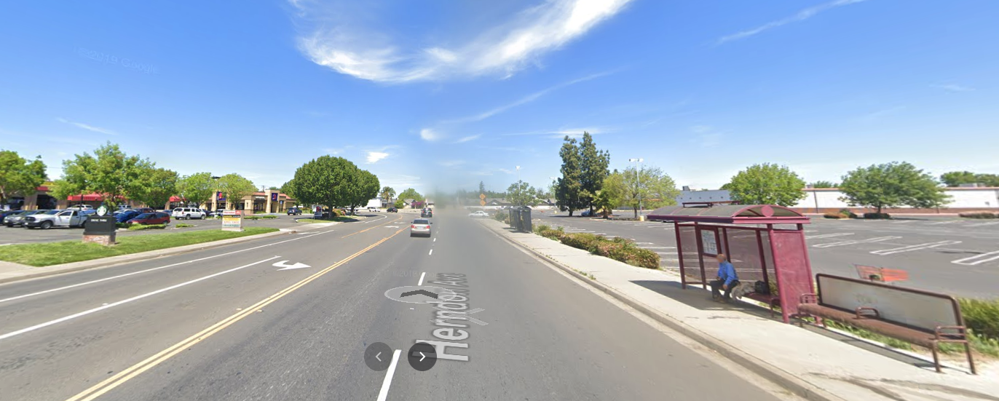

2020--Never heard of it. Just kidding. 2020 was truly, yes I will repeat it, ["unprecedented times"](https://www.dictionary.com/e/s/the-best-words-to-use-during-unprecedented-times/#1) for us all. 

1918 Pandemic with cat wearing a mask.

However, there are those who quite haven't been impacted by the COVID-19 situation, and I feel I've been truly blessed to be somewhat in that cohort, given my recent relative privelege.

What do I mean by that? Let me take a step back...

> Note to the reader: This blog post is not a recommendation into [hustle culture](https://www.youtube.com/watch?v=L9Gpr7PEnbs), financial advise, or imposing political views & opinions.

____

## Self-Reflection

In the past decade, I had the opportunity to both endure and succeed in my initiatives. In that path were underlying 2010 & 2016 5-year goals, graduating from college & getting a career, respectively. However, these ambitions and goals were certainly never expected of me. 

How so? Well, in:

* ~2009: I had the opportunity to drop out of High School, without traditional 'sit-com family confrentational' reprocussions I used to watch.

* 2010: The Great Recession lead me to not finding a job after High School (I was looking for warehouse or Fast Food jobs). So, I enrolled into Junior College, not knowing what to do.
  * 2013: I transferred to UC Davis--truly thankful of their diversity initiatives for accepting me.

* ~2016: I had the opportunity to save up ~2months worth of rent and take a [strategic risk to move to San Francisco](https://raulingaverage.dev/i-wrote-this-when-i-was-a-teller-at-wells-fargo-in-2016/), or move back to Modesto.

> “As a child, I was always one level below the average in math, and I felt incompetent compared to peers.” --[My "5-Year Plan For Career Success" feature in a Udacity blog post](https://blog.udacity.com/2017/12/5-year-plan-for-career-success.html)

**Reiterating**, I had several opportunities to regress into an expected lifestyle, even so without a safety net. However, keeping that in mind, with lot of preparation, grit, network of opportunities & people, **someone to personally help me in my journey**, I am fortunately still able to continue with my goals without minimized 2020 setback--hence the "relative privilege" term.

<blockquote class="twitter-tweet">
“You have to work from one point to go to another point” @ zen_ameer <a href="https://t.co/Wg20TKhEfI">pic.twitter.com/Wg20TKhEfI</a>
&mdash; 2PAC (@2PAC) <a href="https://twitter.com/2PAC/status/1325893011176185857?ref_src=twsrc%5Etfw">November 9, 2020</a></blockquote> 

___

## Motivation for this Roadmap

The above prelude is not a boast, flex, or brag. But rather, a reflection on some thoughts I had in the past couple of years, especially this one...
* How have I given back to lower-income communities, whilst pursuing my ambitions? 
* Am I another case of cruising upwards into middle-class, while ignoring my origins?
* How can I use that same numbing frustration of the [2020 Summer BLM movement](https://www.npr.org/2020/05/29/865685777/why-u-s-needs-black-lives-matter-movement-today), rapid rise of corruption in American government, and deaths of tragic heroes like [Kobe Bryant](https://en.wikipedia.org/wiki/Kobe_Bryant), [Ruth Bader Ginsburg](https://en.wikipedia.org/wiki/Ruth_Bader_Ginsburg), [John Lewis](https://en.wikipedia.org/wiki/John_Lewis), & more as motivation?

Visibily experiencing the [k-shaped](https://www.cnet.com/personal-finance/americas-v-shaped-vs-k-shaped-economic-recovery-what-does-it-all-mean/) bifurcation of the economy, theme of [rich keep on getting richer](https://www.youtube.com/watch?v=15pFQxG9wko), and continuing with my ambitions while not fully being impacted from 'The 'Rona', I have somewhat continued to drift, meanwhile knowing there are others like me that are dealing with their own hardships to a significant degree.

With these considerations, I lay out my Roadmap for the next 5 years.

## 1. Increased Altruism

From the [Black Lives Matter Movement](https://slate.com/podcasts/what-next/2020/12/does-violence-make-protest-more-effective-makes-an-effective-protest), deaths of icons like [Kobe Bryant](https://en.wikipedia.org/wiki/Kobe_Bryant), [Ruth Bader Ginsburg](https://en.wikipedia.org/wiki/Ruth_Bader_Ginsburg), [John Lewis](https://en.wikipedia.org/wiki/John_Lewis), and more, I reflect on the numbing pain of the overarching success they've achieved in their own lives, and relate how I can be a contributing factor to maintain or continue on their initiatives.

> "There has to be an uncomfortable element in the discourse for anything to change. People have to be made to feel uncomfortable, & especially white people — because we are comfortable." - [Gregg Popovich](https://theundefeated.com/features/nba-gregg-popovich-speech-about-white-privilege-felt-like-a-personal-rebuke/)

### 1.1 Contribute your time, not your skills

I am currently, and have, volunteered with Nonprofits these past few years. The responsibilities associated with these contributions have been in Operational & Strategty-capacities. However, was my perceived impact...truly 'impactful', both in perception and [non-performative](https://yaledailynews.com/sjp2020/2020/09/05/a-tale-of-performative-activism-how-black-lives-matter-became-just-a-trend/)?

If true, this insignificant impact to individuals is consequential in that have I given more than I've taken from the San Francisco & other subcommunities that I have been a part of? Moreover, how can I represent the good of tech workers (ignoring the acclaimed [Tech Excodus that is happening in 2020 #CommitTotTheBay](https://www.linkedin.com/pulse/its-time-committothebay-jeff-lawson/?trackingId=%2BdoojZvZQaOFRFdmYNfjHA%3D%3D)).

Sometimes, I felt that wasn't the case--and maybe it was because I haven't had by 'boots to the ground'.

That being said, to give more than I've taken away from the San Francisco community, I need to contribute more time than my skills. Moreover, how can I lead by example both in the subcommunities that I interact with?

<blockquote class="twitter-tweet">
🧵 With many of the Valley’s richest companies fleeing the Bay mid-pandemic, I feel compelled to speak out. There’s no question that California is imperfect. The cost of living, taxes and policies, among other things, make it difficult for lots of people to succeed here. (1/9)
&mdash; Jeff Lawson (@jeffiel) <a href="https://twitter.com/jeffiel/status/1339996375581396999?ref_src=twsrc%5Etfw">December 18, 2020</a></blockquote> 

### 1.2 Share The Codes

This section can be summarized in the following:

<blockquote class="twitter-tweet">
<a href="https://twitter.com/hashtag/SHARETHECODES?src=hash&amp;ref_src=twsrc%5Etfw">#SHARETHECODES</a> 💫🌱 <a href="https://twitter.com/Pharrell?ref_src=twsrc%5Etfw">@Pharrell</a> <a href="https://twitter.com/tylerthecreator?ref_src=twsrc%5Etfw">@tylerthecreator</a> <a href="https://t.co/nJm5WnzGbG">pic.twitter.com/nJm5WnzGbG</a>
&mdash; my.💅🏽 (@_MAYA_A_) <a href="https://twitter.com/_MAYA_A_/status/1331667687815086080?ref_src=twsrc%5Etfw">November 25, 2020</a></blockquote> 

### 1.3 Minimizing predatory mis/dis information to Americans

I've been fortunate to started my journey online in 2009, when I bought my own HP laptop. Starting their, I had the opportunity to grow and contribute to the internet culture with early adoption of [Rage Comic memes](https://www.buzzfeednews.com/article/katienotopoulos/memes-that-defined-the-2010s), [Golden Age of Youtube](https://www.theverge.com/2019/4/5/18287318/youtube-logan-paul-pewdiepie-demonetization-adpocalypse-premium-influencers-creators), and more.

However, many other cohorts have jumped into it without proper introduction, onboarding, or guidance on how to navigate the internet.

(E.g. [The Social deilemma](https://g.co/kgs/LZikMX), tying truth with memes, [Q-Anon](https://abcnews.go.com/Politics/men-qanon/story?id=73046374), echo chambers, etc).

I should also mention even with either younger demographics or even my age group (i.e. younger family members & friends), I would assumed aligned moral ethics and upholdment of truth would reside in their hearts. And resent the corruption that exists now.

However, they've lacked to updating their prior beliefs, and in consequence have a [insufficent update in their posterior belief of particular topics](https://scholar.harvard.edu/files/fryer/files/biasedupdating-mar-12-2017-revised.pdf). In consequence, they accept the unjust. Even to older demographics, how can I educate them on how to properly navigate the internet, meanwhile not impose too much bias into those recommendations?

**This is something I am still thinking about how to solve**. If you have a suitable solution in the meantime, feel free to let me know.

>  "There are three kinds of lies: lies, damned lies, and statistics." --Mark Twain (via my Junior College Stats Professor)

## 2.0 Career

### 2.1 Exponential Growth

In 2016, I graduated with a Bachelors in Applied Mathematics and Minor in Economics. But surprisingly, I didn't know what I wanted to do. [From that time](https://www.youtube.com/watch?v=AGBGetoOW4s&pbjreload=101), I aspired to go into [Data Science](https://towardsdatascience.com/data-sciences-most-misunderstood-hero-2705da366f40), which can be summarized in the opportunity to be featured in a Udacity blog  ["5-Year Plan For Career Success" in a Udacity blog post](https://blog.udacity.com/2017/12/5-year-plan-for-career-success.html) by Caroline Watson.

This year, I have never been in a position to take my next steps into Data Science. With that being said, I plan to do the following:
* Officially have a Data Science title and responsibilties
* Contribute to Open Source
  * Give back more than I've taken from the Python community (i.e. not being part of the 'Stadium' users, mentioned by [Working in Public: The Making and Maintenance of Open Source by Nadia Eghbal](https://www.amazon.com/Working-Public-Making-Maintenance-Software/dp/0578675862))
* Continue with Data-related Nonprofit contributions

### 2.2 Transparent Background

Linkedin
* I'll be more transparent about my background both on Linkedin and my curated [Job Search Preparation material](https://raulingaverage.dev/job-search) for lower-income individuals who are interested in starting their career.

That being said, let me explain my blog cover...

My first job was at Taco Bell, in 2007. In between transfeering buses to get to High School, I went into that Taco Bell asking, honestly annoying, the team & manager if they had an open position. It took a few months, but I had a shot at getting a job.
* ...I failed the interview, but the manager liked my perseverance and I got the job.

Mentions
* Offer more transparent background in workshop/talks

## 3.0 Personal

Here are some personal goals that I also would like reach:

* Celebrating [my 10 year anniversary of running a Marathon](https://results.rmraces.live/Modesto-Marathon/events/2011/Modesto-Marathon/274/entrant/share).

* Losing weight, per usual :cry:

* Frequently travel to the London

* Travel to five Countries, that I have not already been to.

* Attend [Defcon Festival by Q-dance in Europe](https://youtu.be/vJ2eHsQv7Ac?t=3779)

* Home Ownership?

## Wrapping it all up

Looking back into past decade, I've updated my goals to center around more impactful altruistic contributions, meanwhile pursuiing my career path & personal goals.

Now, I end with this Roadmap with two sentimental songs I heard as a kid.

<iframe width="560" height="315" src="https://www.youtube.com/embed/Kxi3RQl6xVI" frameborder="0" allow="accelerometer; autoplay; clipboard-write; encrypted-media; gyroscope; picture-in-picture" allowfullscreen></iframe>

> Ignore the fact Kanye West is in the above video (I.e. 'I miss the old Kanye...I hate the new Kanye.')

<iframe width="560" height="315" src="https://www.youtube.com/embed/RvVfgvHucRY" frameborder="0" allow="accelerometer; autoplay; clipboard-write; encrypted-media; gyroscope; picture-in-picture" allowfullscreen></iframe>